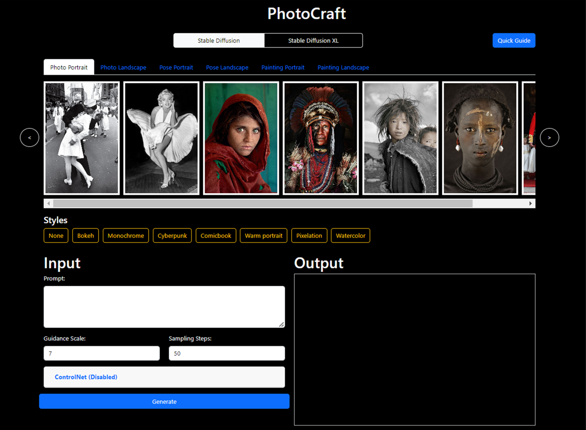

# PhotoCraft

A customized web interface, crafted for user-friendliness and seamlessly integrated with ControlNet, implemented using the Diffuser Pipeline framework.

You can find the demo video at this link: https://www.youtube.com/watch?v=wRApR8oKIP0

Prerequisites:
- Visual Studio Code (vsCode): Download and install vsCode.
- Git: Download and install Git.
- Python 3.10.6: Download and install Python 3.10.6 and add it to your system's PATH.
- Node.js: Download and install Node.js.

Installation Steps:
1.	Clone PhotoCraft Repository: Clone the PhotoCraft repository to your local directory.

2.	Install Dependencies: Open your command prompt and install the following Python dependencies: 
- pip install uvicorn
- pip install pandas
- pip install openpyxl
- pip install fastapi
- pip install diffusers
- pip install opencv-python
- pip install controlnet-aux==0.0.3
- pip install transformers
- pip install python-multipart
- pip install accelerate
- pip install torch torchvision torchaudio --index-url https://download.pytorch.org/whl/cu118

4.	Running the API Server: 
- Use VSCode to open the cloned PhotoCraft repository.
- Right-click on the api directory and select "Open in Integrated Terminal".
- In the terminal, execute the following command: uvicorn api:app --reload

5.	Running the Client Server:
- Right-click on the client directory and select "Open in Integrated Terminal".
- Run the following command to install the necessary dependencies: npm install
- After installation, start the development server by running: npm start

